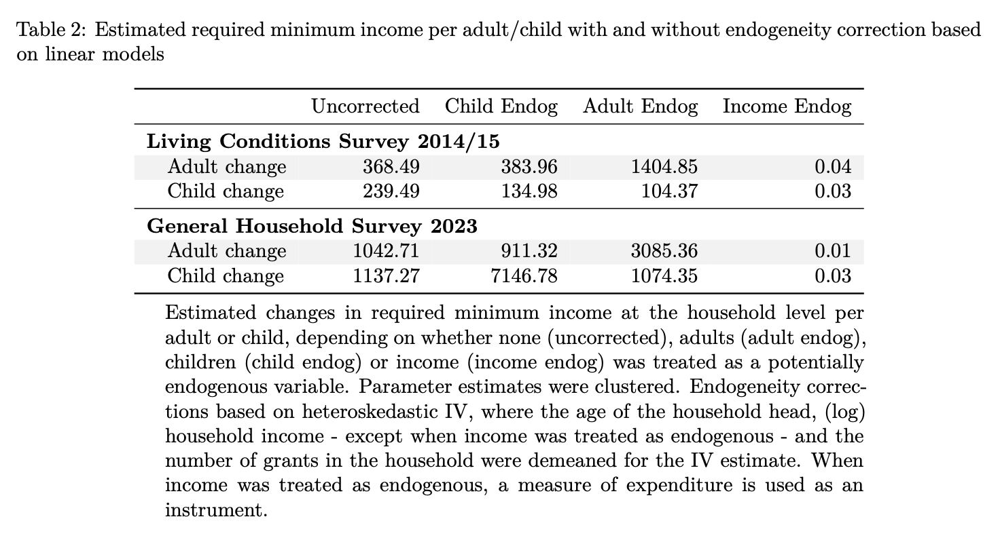

```{r setup, include=FALSE}

# Defining text size in various chunks 
def.chunk.hook  <- knitr::knit_hooks$get("chunk")
knitr::knit_hooks$set(chunk = function(x, options) {
  x <- def.chunk.hook(x, options)
  ifelse(options$size != "normalsize", paste0("\\", options$size,"\n\n", x, "\n\n \\normalsize"), x)
})

## libraries - data management
library(tidyverse)
library(skimr)
library(readxl)
library(janitor)
library(haven)

## libraries - tables
library(knitr)
library(kableExtra)
library(stargazer)
library(gt)

## libraries - plots
library(ggthemes)

## libraries - inequality
library(ineq)

## Estimation
library(np)
options(np.messages=FALSE)


set.seed(42) # randomness to get same results
```

## Some background

1. Much of the discussion comes from @deaton1997analysis and @odonnell2008health

1. There are many other texts that offer similar information

1. We will mostly make use of standard features of R

1. We will also use many of the packages we have used so far

1. I might add in the np-package [@np-pack]

## Today's objectives

1. Describe social welfare

1. Discuss a variety of measures of inequality

1. Estimate/calculate some of those measures

# Welfare and Inequality

## Social welfare

- Imagine a population of size $n$
- Consider a random variable $y$ 
- It is distributed across the population according to $F(y)$
- A social welfare function is a statistical aggregator over $y$.^[Political economy and many other things keep this function from being a policy 'objective' to be maximized subject to a set of constraints.]

$$
W(y) = V(y_1, y_2, \dots, y_n)
$$

## A few basic properties

1.  Nondecreasing:

$$
V(y_1, y_2, \dots, y_n) \leq V(y_1, y_2+1, \dots, y_n) 
$$

2.  Anonymity/symmetry: who has what does not affect welfare

$$
V(y_1, y_2, \dots, y_n) = V(y_2, y_1, \dots, y_n)
$$

## A common assumption leads to an important principle

3.  Societal preferences for equality
    i.  Diminishing marginal social welfare
    i.  Quasi-concavity
    i.  Given $x^1$ and $x^2$ list two different sets of $y$
    i.  Also, $V(x^1) = V(x^2)$, then $\forall \lambda \in [0,1]$
    
$$
V\left(\lambda x^1 + (1-\lambda) x^2\right) \geq V(x^1) = V(x^2)
$$

4.  Principle of transfers: Inequality falls when rich transfer something to the poor

## One final useful assumption

5.  Social welfare is homogeneous of degree 1

$$
W(ky_1, ky_2, \dots) = k^1 W(y_1, y_2)
$$

- Assume $k = \overline y \equiv \mu$

$$
W(y_1, y_2, \dots) = \frac{1}{\mu} V(\frac{y_1}{\mu}, \frac{y_2}{\mu}, \dots)
$$

## Normalisation

6.  Equality has a baseline

$$
\begin{aligned}
W = V(1, 1, \dots, 1) &= 1 \\
W = V(\mu, \mu, \dots, \mu) &= \mu
\end{aligned}
$$

- So, if the distribution is unequal
- Welfare cannot be larger than it was
- $I$ is a measure of inequality

$$
W = \mu (1-I)
$$

## Atkinson's welfare function

- Social welfare is 
  i.  Additive
  i.  Captures inequality aversion
  i.  Like CES, but $\epsilon \neq 1$

$$
W = n^{-1} \sum_i \frac{y_i^{1-\epsilon}}{1-\epsilon}
$$

## Atkinson welfare special case

- If $\epsilon = 1$

$$
\ln W = n^{-1} \sum_i \ln y_i
$$

## The Atkinson property I

- Marginal social utility for any two individuals is determined by their respective $y$

$$
\frac{\partial W/\partial y_1}{\partial W/\partial y_2} = 
\left(\frac{y_2}{y_1}\right)^\epsilon
$$

- If $\epsilon = 0$, 
    - No inequality aversion
    - $W = \mu$

## Atkinson property 2    

- If $\epsilon = 2$, and $y_1 = 2y_2$
- Welfare improves if the poorest get a bit extra, relative to the rich

$$
\frac{\partial W/\partial y_1}{\partial W/\partial y_2} = 
\left(\frac{y_2}{2y_2}\right)^2 = \frac{1}{4}
$$

- As $\epsilon \rightarrow \infty$
- Welfare focuses on the poorest
- Rawlsian or maximin

## Atkinson's inequality measure

- When $\epsilon \neq 1$

$$
I = 1 - \left( n^{-1} \sum_i \left(\frac{y_1}{\mu} \right)^{1-\epsilon} \right)^{1/(1-\epsilon)}
$$


- When $\epsilon = 1$

$$
I = 1 - \prod_i \left( \frac{y_i}{\mu} \right)^{(1/n)}
$$

## Code to visualize Atkison

```{r}
#| eval: false

# Generate skewed income data
set.seed(123)
income <- rlnorm(100, meanlog = 10, sdlog = 1)

# Calculate Atkinson Index for different levels of inequality aversion
eps_values <- c(0.5, 1, 2)
atk_results <- sapply(eps_values, function(e) Atkinson(income, parameter = e))

# Create a data frame for plotting
df_atk <- data.frame(
  epsilon = as.factor(eps_values),
  atkinson_index = atk_results
)

# Plotting the sensitivity to epsilon
ggplot(df_atk, aes(x = epsilon, y = atkinson_index, fill = epsilon)) +
  geom_bar(stat = "identity") +
  labs(title = "Atkinson Index Sensitivity to Inequality Aversion",
       subtitle = "Higher epsilon (ε) places more weight on the bottom of the distribution",
       x = "Inequality Aversion (ε)",
       y = "Atkinson Index Value") +
  theme_solarized()
```


## Code to visualize Atkison

```{r}
#| label: atkinson-plot
#| echo: false
#| fig-cap: "Atkinson inequality depends on aversion to inequality"

# Generate skewed income data
set.seed(123)
income <- rlnorm(100, meanlog = 10, sdlog = 1)

# Calculate Atkinson Index for different levels of inequality aversion
eps_values <- c(0.5, 1, 2)
atk_results <- sapply(eps_values, function(e) 
  Atkinson(income, parameter = e))

# Create a data frame for plotting
df_atk <- data.frame(
  epsilon = as.factor(eps_values),
  atkinson_index = atk_results
)

# Plotting the sensitivity to epsilon
ggplot(df_atk, aes(x = epsilon, y = atkinson_index, fill = epsilon)) +
  geom_bar(stat = "identity") +
  labs(title = "Atkinson Index Sensitivity to Inequality Aversion",
       subtitle = "Higher epsilon (ε) places more weight on the bottom of the distribution",
       x = "Inequality Aversion (ε)",
       y = "Atkinson Index Value") +
  theme_solarized()
```

## The Gini Coefficient

The **Gini Coefficient** is a statistical measure of distribution developed by Corrado Gini in 1912. It is the most commonly used indicator of [income or wealth inequality](https://www.imf.org/en/topics/inequality/introduction-to-inequality).

*   **Scale**: It ranges from **0 to 1** (or 0% to 100%).
*   **0 (Perfect Equality)**: Everyone has the exact same income.
*   **1 (Perfect Inequality)**: One person has all the income; everyone else has zero.
*   **Interpretation**: Higher values indicate [greater inequality](https://ourworldindata.org/what-is-the-gini-coefficient).

## Mathematical Definition

The Gini is calculated using the **Lorenz Curve**, which plots the cumulative share of population against the cumulative share of income.

$$G = \frac{A}{A + B}$$

*   **Area A**: The area between the "Line of Perfect Equality" (45° line) and the Lorenz Curve.
*   **Area B**: The area under the Lorenz Curve.
*   **Note**: Since $A + B = 0.5$ in a normalized plot, the formula simplifies to $G = 2A$.

## Gini from microdata

- Take a look at Our World in [Data](https://ourworldindata.org/what-is-the-gini-coefficient)
- It is the difference we would expect to find between two randomly chosen individuals in the population
- This depends also on how wide the distribution
- $\rho_i$ is $i$'s rank in the population, richest to poorest


$$
\gamma = \frac{n+1}{n-1} - \frac{2}{n(n-1)\mu} \sum_i \rho_i y_i
$$

## Some final Gini thoughts

- Technically, the Gini arises from a social welfare function that depends on the individual's rank (larger for the poor)
- Given the Gini $(\gamma)$ social welfare is

$$
W = \mu \left( 1-\gamma \right)
$$

## Code to visualize (Gini) inequality 

- We generate log-normal "income" data 
- This gives a "realistic" income distribution 

```{r}
#| eval: false

# 1. Generate random income (Lognormal is typical for income)
set.seed(42)
income_data <- rlnorm(200, meanlog = 2, sdlog = 1)

# 2. Calculate Lorenz Curve and Gini
lorenz <- Lc(income_data)
gini_val <- round(Gini(income_data), 3)

# 3. Create Plot
df <- data.frame(p = lorenz$p, L = lorenz$L)
ggplot(df, aes(x = p, y = L)) +
  geom_line(linewidth = 1, color = "darkblue") +
  geom_abline(slope = 1, intercept = 0, linetype = "dashed", color = "red") +
  annotate("text", x = 0.2, y = 0.8, label = paste("Gini Index:", gini_val), size = 6) +
  labs(title = "Lorenz Curve Illustration",
       x = "Cumulative % of Population", 
       y = "Cumulative % of Income") +
  theme_solarized()
```

## Visualize (Gini) inequality


```{r}
#| label: gini-plot
#| fig-align: "center"
#| echo: false
#| fig-cap: "Lorenz Curve for Gini"

# 1. Generate random income (Lognormal is typical for income)
set.seed(42)
income_data <- rlnorm(200, meanlog = 2, sdlog = 1)

# 2. Calculate Lorenz Curve and Gini
lorenz <- Lc(income_data)
gini_val <- round(Gini(income_data), 3)

# 3. Create Plot
df <- data.frame(p = lorenz$p, L = lorenz$L)
ggplot(df, aes(x = p, y = L)) +
  geom_line(linewidth = 1, color = "darkblue") +
  geom_abline(slope = 1, intercept = 0, linetype = "dashed", color = "red") +
  annotate("text", x = 0.2, y = 0.8, label = paste("Gini Index:", gini_val), size = 6) +
  labs(title = "Lorenz Curve Illustration",
       x = "Cumulative % of Population", y = "Cumulative % of Income") +
  theme_solarized()
```

# Poverty

## Headcount ratios

- Rather intuitive, counting the number of poor, but as a share of the population
- Or, the number of people below some *poverty line*, $\ell$
- Kind of social welfare function focusing on the poor...

$$
P_0 = n^{-1} \sum \mathbf{1}(y_i \leq \ell)
$$

## Very discontinuous function

- The barely poor and very poor are counted the same
- Why not pay some attention to how poor?
- The poverty gap
    - Count the poor (as before)
    - And how poor they are (using shortfalls)

$$
P_1 = n^{-1} \sum \left( 1 - \frac{y_i}{\ell} \right) \mathbf{1}(y_i \leq \ell)
$$
- Intuitively, this is a per capita measure of the shortfall
- Tempting to think of as cost of eliminating poverty, but that ignores the economic ramifications of raising/transferring the amounts across individuals, even when administration is efficient and not corrupt

## Poverty gap continued

- It is basically continuous
- It is basically concave
- So, principle of transfers holds  
  - Increases when poor transfer to nonpoor
  - Increases when poor transer to less poor who become nonpoor
  - Transfers among the poor don't change it though
  
## Foster, Greer and Thorbecke

- See @foster1984
- They generalise the above discussion

$$
P_\alpha = n^{-1} \sum \left( 1 - \frac{y_i}{\ell} \right)^\alpha \mathbf{1}(y_i \leq \ell)
$$

- When $\alpha = 0$, we get $P_0$
- When $\alpha = 1$, we get $P_1$
- $\alpha = 2$ is most commonly considered in papers (severity)
  - Larger value puts more weight on poor outcomes
  - Thus, penalizes society's by the number of poor and how poor they are

## One more thought experiment

- How does one determine such a poverty line?
  - MinQ
  - Food adequacy
  - Other
  
- Look at our MinQ draft paper, briefly

## Per child and adult poverty line estimates



# Distributions and comparisons

## A thought experiment

- What if we wanted to compare inequality over time
  - Look at the Gini or Atkinson index over time
  - These are aggregate measures: some get more, some get less
  - Aggregates could mask changes within?
  
- Could we dive in deeper?
    - Concentration curves: extends the Lorenz idea to multiple dimensions
    - Stochastic dominance: Offers (potential) statistical meaning to a comparison
    
## Concentration curve

- Drop social welfare (for now)
- Keep our measure $y_i$, which can be sorted/ranked from low to high or vice versa (it might be income)
- We will add another measure, say $z_i$, which can also be sorted and ranked (it might be a burden)
- The curve plots the cumulative percentage of the population over the burden (from lowest to highest income) against the cumulative percentage of the population over income (ranked poorest to richest).

## Code to visualizes a concentration curve

```{r}
#| eval: false

# 1. Generate data
set.seed(123)
n <- 1000
income <- rlnorm(n, meanlog = 10, sdlog = 1)

# Pro-poor spending (inversely related to income)
public_spend <- 5000 / (income^0.2) + rnorm(n, 0, 10) 
# Pro-rich spending (positively related to income)
private_spend <- (income^1.2) / 1000 + rnorm(n, 0, 10)

df <- data.frame(income, public_spend, private_spend) |>
  arrange(income) |>
  mutate(
    cum_pop = row_number() / n,
    cum_public = cumsum(public_spend) / sum(public_spend),
    cum_private = cumsum(private_spend) / sum(private_spend)
  )

# 2. Plotting
ggplot(df) +
  geom_line(aes(x = cum_pop, y = cum_public, color = "Public (Pro-Poor)"), linewidth = 1) +
  geom_line(aes(x = cum_pop, y = cum_private, color = "Private (Pro-Rich)"), linewidth = 1) +
  geom_abline(slope = 1, intercept = 0, linetype = "dashed") +
  labs(title = "Concentration Curves for Healthcare Spending",
       subtitle = "Population ranked by Income (Poorest to Richest)",
       x = "Cumulative % of Population (by Income Rank)",
       y = "Cumulative % of Spending",
       color = "Spending Type") +
  theme_solarized()

```

## Visualize a concentration curve


```{r}
#| label: concentration-plot
#| echo: false
#| fig-cap: "Concentration curves for private and public healthcare spending"

# 1. Generate data
set.seed(123)
n <- 1000
income <- rlnorm(n, meanlog = 10, sdlog = 1)

# Pro-poor spending (inversely related to income)
public_spend <- 5000 / (income^0.2) + rnorm(n, 0, 10) 
# Pro-rich spending (positively related to income)
private_spend <- (income^1.2) / 1000 + rnorm(n, 0, 10)

df <- data.frame(income, public_spend, private_spend) |>
  arrange(income) |>
  mutate(
    cum_pop = row_number() / n,
    cum_public = cumsum(public_spend) / sum(public_spend),
    cum_private = cumsum(private_spend) / sum(private_spend)
  )

# 2. Plotting
ggplot(df) +
  geom_line(aes(x = cum_pop, y = cum_public, color = "Public (Pro-Poor)"), linewidth = 1) +
  geom_line(aes(x = cum_pop, y = cum_private, color = "Private (Pro-Rich)"), linewidth = 1) +
  geom_abline(slope = 1, intercept = 0, linetype = "dashed") +
  labs(title = "Concentration Curves for Healthcare Spending",
       subtitle = "Population ranked by Income (Poorest to Richest)",
       x = "Cumulative % of Population (by Income Rank)",
       y = "Cumulative % of Spending",
       color = "Spending Type") +
  theme_solarized()

```

# South African Data

## Somewhat practical SA example

- Let us look at food expenditure as a share of total expenditure in the household
- Let us also look at income and expenditure, maybe per capita?
- Let us compare Western Cape and Mpumalanga
- So, read in the data
  - Calculate the food share
  - Draw some pictures
  
## Read in the data

```{r}
#| label: data

# get food expenditure
food_totals <-  read_dta("../Data/lcs/lcs-2014-2015-total-v1.dta") |>
  clean_names() |>
  select(uqno, secondary_group, third_group, valueannualized_adj) |>
  filter(secondary_group >= 1, secondary_group < 20) |>
  mutate(tg = as_factor(third_group)) |> 
  group_by(uqno) |>
  summarise(food_expend = sum(valueannualized_adj), .groups = "drop") |> # food categories
  droplevels() 

# Get household information for income and expenditure

# Get the income, province and expend data, 
# Adding 1 to income, so no more '0' values 
# Probably better ways, we are just being quick
household <- read_dta ( "../Data/lcs/lcs-2014-2015-households-v1.dta") |> 
  clean_names() |>
  select (uqno, 
          income = income_inkind, 
          expenditure = expenditure_inkind,
          province_code) |>
  mutate(uqno = as.character(uqno),
         province = as_factor(province_code),
         log_income = log(income+1),
         log_expenditure = log(expenditure)) 

# merge and create food share
final_df <- inner_join(food_totals,
                       household, 
                       by = "uqno") |>
  mutate(food_share = food_expend/expenditure) |>
  drop_na()
```

## Code to plot income and expenditure Lorenz 


```{r}
#| eval: false

# 1. Data already read in

# 2. Calculate Lorenz Curve and Gini
lorenz_income = Lc(final_df$income)
gini_income <- round(Gini(final_df$income), 3)

lorenz_expenditure = Lc(final_df$expenditure)
gini_expend <- round(Gini(final_df$expenditure), 3)

lorenz_df <- tibble(p_income = lorenz_income$p,
                    L_income = lorenz_income$L,
                    p_expenditure = lorenz_expenditure$p,
                    L_expenditure = lorenz_expenditure$L)


# 3. Create Plot
lorenz_df |>
ggplot(aes(x = p_income, y = L_income)) +
  geom_line(linewidth = 1, color = "darkblue") +
  geom_abline(slope = 1, intercept = 0, linetype = "dashed", color = "red") +
  annotate("text", x = 0.2, y = 0.8, label = paste("Income Gini Index:", gini_income), size = 6, col = "darkblue") +
  geom_line(aes(x = p_expenditure, y = L_expenditure), 
            linewidth = 1, color = "lightblue") +
  annotate("text", x = 0.2, y = 0.6, label = paste("Expenditure Gini Index:", gini_expend), size = 6, col = "lightblue") +
  labs(title = "Lorenz Curves of Income and Expenditure",
       x = "Cumulative % of Population", 
       y = "Cumulative % of Income/Expenditure",
       caption = "Source: SA LCS 2014-15") +
  theme_solarized()
```


## Plot of income and expenditure Lorenz curves

```{r}
#| label: SAmicro-gini-plot
#| dependson: data
#| echo: false
#| fig-cap: "Lorenz Curve for Income and Expenditure in LCS data"


# 2. Calculate Lorenz Curve and Gini
lorenz_income = Lc(final_df$income)
gini_income <- round(Gini(final_df$income), 3)

lorenz_expenditure = Lc(final_df$expenditure)
gini_expend <- round(Gini(final_df$expenditure), 3)

lorenz_df <- tibble(p_income = lorenz_income$p,
                    L_income = lorenz_income$L,
                    p_expenditure = lorenz_expenditure$p,
                    L_expenditure = lorenz_expenditure$L)


# 3. Create Plot
lorenz_df |>
ggplot(aes(x = p_income, y = L_income)) +
  geom_line(linewidth = 1, color = "darkblue") +
  geom_abline(slope = 1, intercept = 0, linetype = "dashed", color = "red") +
  annotate("text", x = 0.2, y = 0.8, label = paste("Income Gini Index:", gini_income), size = 6, col = "darkblue") +
  geom_line(aes(x = p_expenditure, y = L_expenditure), 
            linewidth = 1, color = "lightblue") +
  annotate("text", x = 0.2, y = 0.6, label = paste("Expenditure Gini Index:", gini_expend), size = 6, col = "lightblue") +
  labs(title = "Lorenz Curves of Income and Expenditure",
       x = "Cumulative % of Population", 
       y = "Cumulative % of Income/Expenditure",
       caption = "Source: SA LCS 2014-15") +
  theme_solarized()
```

## Code for food share Ginis
  
```{r}
#| eval: false

# 1. Subsetted data, not really pretty code
WC <- final_df |>
  filter(province == "Western Cape")

MP <- final_df |>
  filter(province == "Mpumalanga")

# 2. Calculate Lorenz Curves and Ginis
lorenz_WC = Lc(WC$food_share)
gini_WC <- round(Gini(WC$food_share), 3)

lorenz_MP = Lc(MP$food_share)
gini_MP <- round(Gini(MP$food_share), 3)

WC_df <- tibble(p = lorenz_WC$p,
                L = lorenz_WC$L,
                province = "WC")

MP_df <- tibble(p = lorenz_MP$p,
                L = lorenz_MP$L,
                province = "MP")

lorenz_df = rbind(WC_df, MP_df) |>
  mutate(province = as.factor(province))

# 3. Create Plot
ggplot(lorenz_df, aes(x = p, y = L, 
                      colour = province)) +
  scale_color_manual(
    values = c("WC" = "darkblue", "MP" = "lightblue")
  ) +
  geom_line(linewidth = 1) +
  geom_abline(slope = 1, intercept = 0, linetype = "dashed", color = "red") +
  annotate("text", x = 0.2, y = 0.8, label = paste("WC Gini Index:", gini_WC), size = 6, col = "darkblue") +
  annotate("text", x = 0.2, y = 0.6, label = paste("MP Gini Index:", gini_MP), size = 6, col = "lightblue") +
  labs(title = "Lorenz Curves of Food Share (WC v MP)",
       x = "Cumulative % of Population", 
       y = "Cumulative % of Income/Expenditure",
       caption = "Source: SA LCS 2014-15") +
  theme_solarized()
```

## Food share Ginis

```{r}
#| label: foodshare-gini-plot
#| dependson: data
#| echo: false
#| fig-cap: "Lorenz Curve for Food Shares across two provinces in South Africa"

# 1. Subsetted data, not really pretty code
WC <- final_df |>
  filter(province == "Western Cape")

MP <- final_df |>
  filter(province == "Mpumalanga")

# 2. Calculate Lorenz Curves and Ginis
lorenz_WC = Lc(WC$food_share)
gini_WC <- round(Gini(WC$food_share), 3)

lorenz_MP = Lc(MP$food_share)
gini_MP <- round(Gini(MP$food_share), 3)

WC_df <- tibble(p = lorenz_WC$p,
                L = lorenz_WC$L,
                province = "WC")

MP_df <- tibble(p = lorenz_MP$p,
                L = lorenz_MP$L,
                province = "MP")

lorenz_df = rbind(WC_df, MP_df) |>
  mutate(province = as.factor(province))

# 3. Create Plot
ggplot(lorenz_df, aes(x = p, y = L, 
                      colour = province)) +
  scale_color_manual(
    values = c("WC" = "darkblue", "MP" = "lightblue")
  ) +
  geom_line(linewidth = 1) +
  geom_abline(slope = 1, intercept = 0, linetype = "dashed", color = "red") +
  annotate("text", x = 0.2, y = 0.8, label = paste("WC Gini Index:", gini_WC), size = 6, col = "darkblue") +
  annotate("text", x = 0.2, y = 0.6, label = paste("MP Gini Index:", gini_MP), size = 6, col = "lightblue") +
  labs(title = "Lorenz Curves of Food Share (WC v MP)",
       x = "Cumulative % of Population", 
       y = "Cumulative % of Income/Expenditure",
       caption = "Source: SA LCS 2014-15") +
  theme_solarized()
```

## Brief discussion

1.  Income and expenditure
    a.  Income more unequal
    a.  Suggestive of stochastic dominance (?)
    a.  Both very high
    a.  Did you expect this? Why/Why not?

1.  Food shares
    a.  Western Cape more unequal
    a.  Neither as bad as income or expenditure
    a.  Expected? Why? Why not?

## Code for concentration curves: Food share 

```{r}
#| eval: false

# 1. data is already there
# but manipulate it to get the concentrations
# a bit like an empirical cdf

income_df <- final_df |>
  select(food_share, income) |>
  arrange(income) |>
  transmute(
    cum_pop = row_number() / n(),
    cum_fs = cumsum(food_share) / sum(food_share),
    mapping = "income"
  )

expend_df <- final_df |>
  select(food_share, expenditure) |>
  arrange(expenditure) |>
  transmute(
    cum_pop = row_number() / n(),
    cum_fs = cumsum(food_share) / sum(food_share),
    mapping = "expenditure"
  )

df <- rbind(income_df, expend_df) |>
  mutate(mapping = as.factor(mapping))

# 2. Plotting
df |>
  ggplot(aes(x = cum_pop, y = cum_fs, color = mapping)) +
  geom_line(linewidth = 1) +
  geom_abline(slope = 1, intercept = 0, linetype = "dashed") +
  labs(title = "Concentration Curves for Food Shares",
       subtitle = "Population ranked (Poorest to Richest)",
       x = "Cumulative % of Population (by Rank)",
       y = "Cumulative % of Food Budget Share",
       color = "Ranking variable") +
  theme_solarized()

```


## Concentration curve: Food share 

```{r}
#| label: foodshare-concentration-plot
#| echo: false
#| fig-cap: "Concentration curves for food share v income/exenditure"

# 1. data is already there
# but manipulate it to get the concentrations
# a bit like an empirical cdf

income_df <- final_df |>
  select(food_share, income) |>
  arrange(income) |>
  transmute(
    cum_pop = row_number() / n(),
    cum_fs = cumsum(food_share) / sum(food_share),
    mapping = "income"
  )

expend_df <- final_df |>
  select(food_share, expenditure) |>
  arrange(expenditure) |>
  transmute(
    cum_pop = row_number() / n(),
    cum_fs = cumsum(food_share) / sum(food_share),
    mapping = "expenditure"
  )

df <- rbind(income_df, expend_df) |>
  mutate(mapping = as.factor(mapping))

# 2. Plotting
df |>
  ggplot(aes(x = cum_pop, y = cum_fs, color = mapping)) +
  geom_line(linewidth = 1) +
  geom_abline(slope = 1, intercept = 0, linetype = "dashed") +
  labs(title = "Concentration Curves for Food Shares",
       subtitle = "Population ranked (Poorest to Richest)",
       x = "Cumulative % of Population (by Rank)",
       y = "Cumulative % of Food Budget Share",
       color = "Ranking variable") +
  theme_solarized()

```

## Food shares

1. Food shares are pro-rich
1. That is "Engel's Law": The poor spend more of their budgets on food
1. Here, we do not see obvious direct stochastic dominance
1. We would need to think a bit more about testing it.
1. We will look at that next time...


## References 

